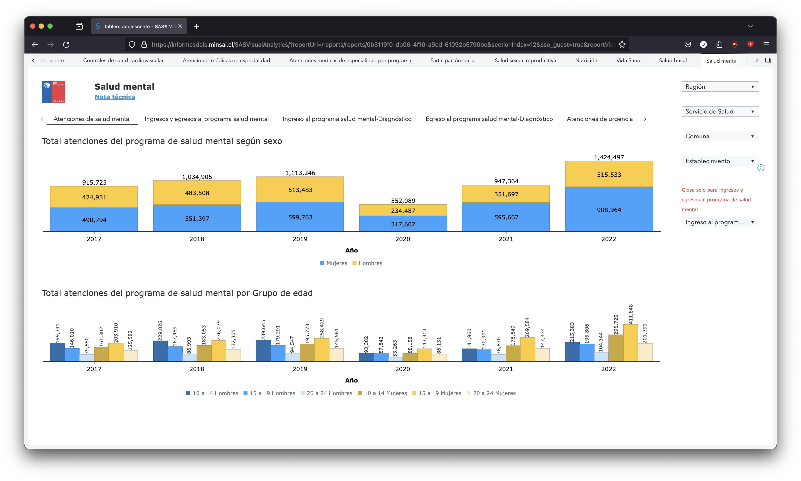
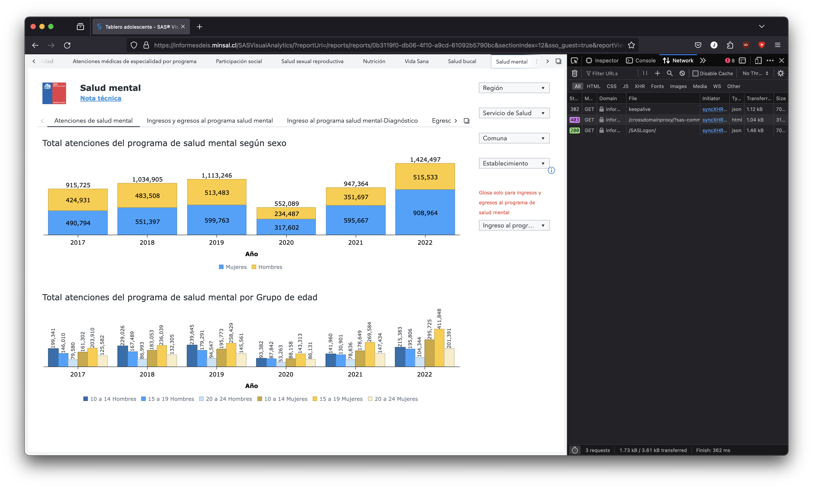
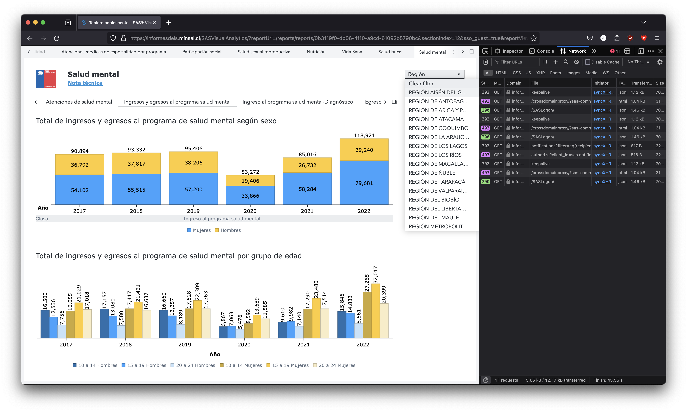
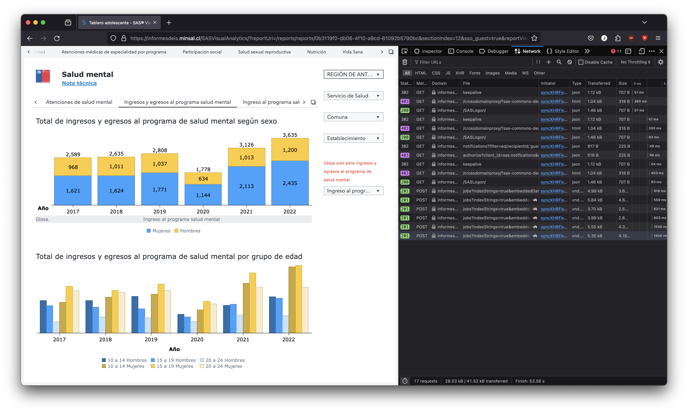
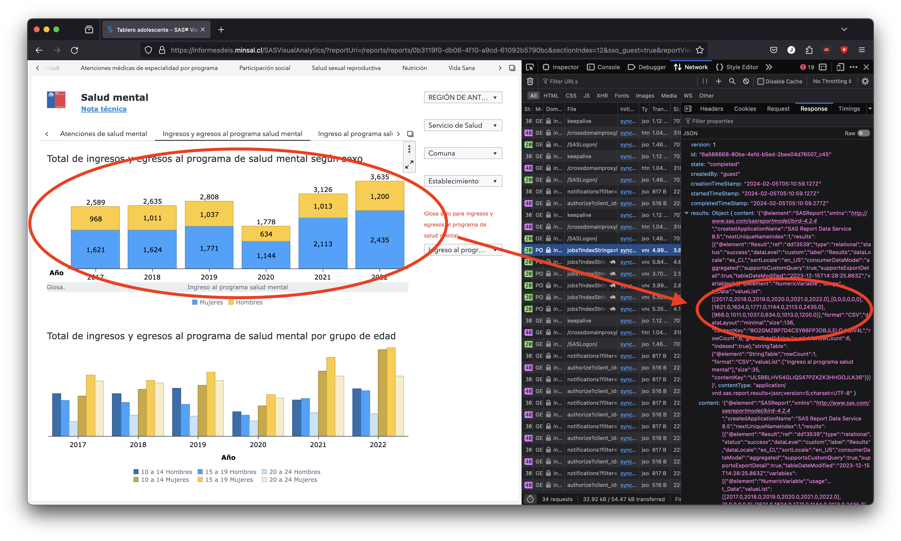

# mental-health scraper

This project scrapes a bunch of reports from DEIS, the reports can be found in the following links:
- reporteria adolescente: https://informesdeis.minsal.cl/SASVisualAnalytics/?reportUri=/reports/reports/0b3119f0-db06-4f10-a9cd-61092b5790bc&sectionIndex=12&sso_guest=true&reportViewOnly=true&reportContextBar=false&sas-welcome=false
- reporteria salud mental: https://informesdeis.minsal.cl/SASVisualAnalytics/?reportUri=/reports/reports/ad0c03ad-ee7a-4da4-bcc7-73d6e12920cf&sso_guest=true&reportViewOnly=true&reportContextBar=false&sas-welcome=false

## Running
```
// sh
npm install
npx eslint src --fix; rm -rf dist/; rm -rf data/*; npx tsc; node dist/main.js

// powershell
npm install
npx eslint src --fix; rm dist/ -r -fo; rm data/ -r -fo; npx tsc; node dist/main.js
```

## How to scrape more reports

This project can scrape SAS Visual Analytics websites, tested on https://informesdeis.minsal.cl

To scrape additional reports the following components must be implemented:
1. A `writer`: The writer communicates to the scrapper what reports must be downloaded, what `payload` to use to download the reports, and writes the downloaded report to the disk. The `writer` must implement the following functions:
    1. `static getRequiredPayloads(): string[]` returns the columns the report contains
    2. `static write(_context: Context, _client: DeisClient, results: DeisResults): void` receives the results and writes them to disk
2. A `payload`: The payload is used to request the desired report. The payload must be extracted from the frontend by manually checking the desired report.

## How to get the payload for a report
1. Open your desired report on the target SAS Visual Analytics website
    
2. Open the 'Requests' tab on the Developer tools of your browser
    
3. Change any of the filters
    
4. Once the filter applies, you will see multiple 'jobs' requests, one for each graph on the report
    
5. Click on the requests and check the response to ensure that the request corresponds to your desired graph
    
6. Once you identify the network request for your desired graph, copy the payload of the request to the `payloads` folder in this project
    